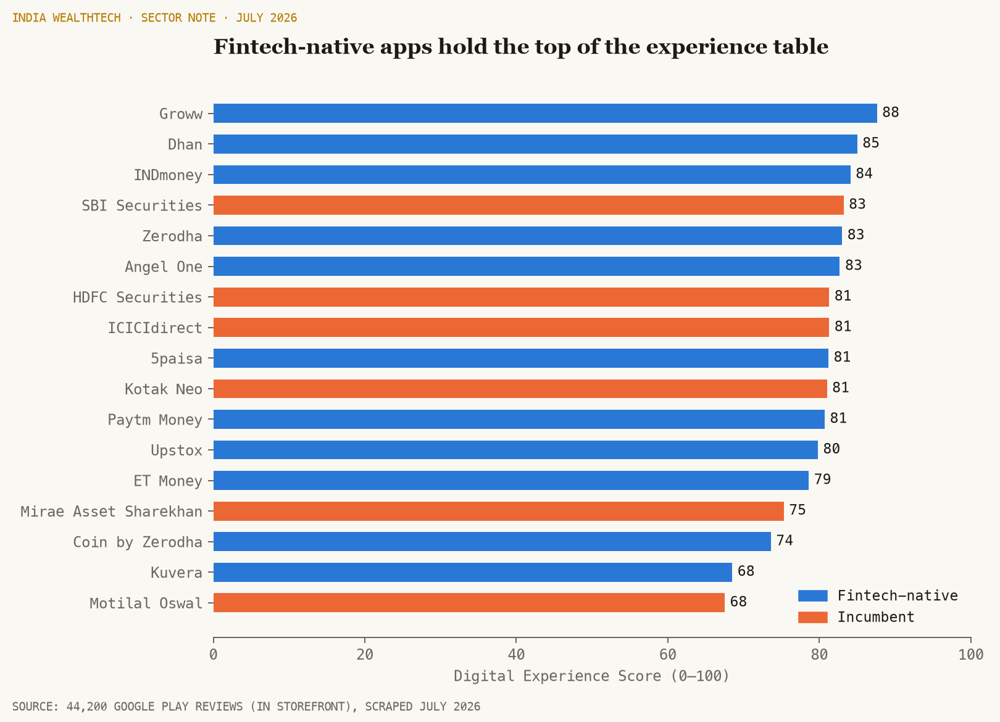
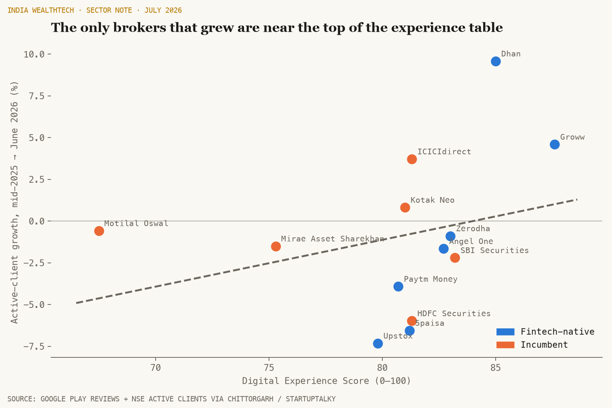
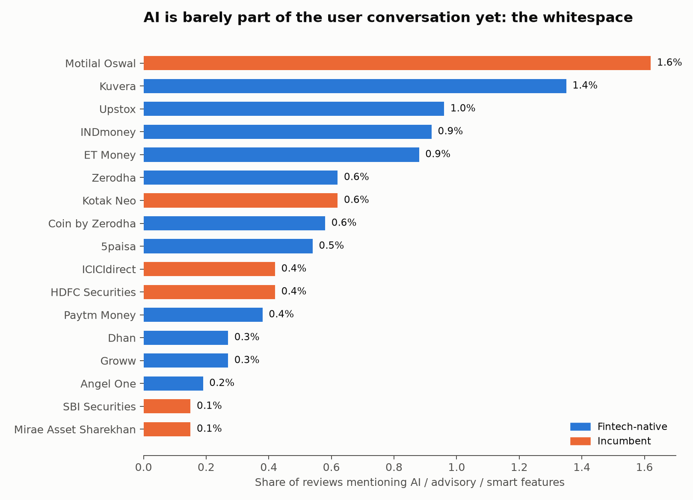
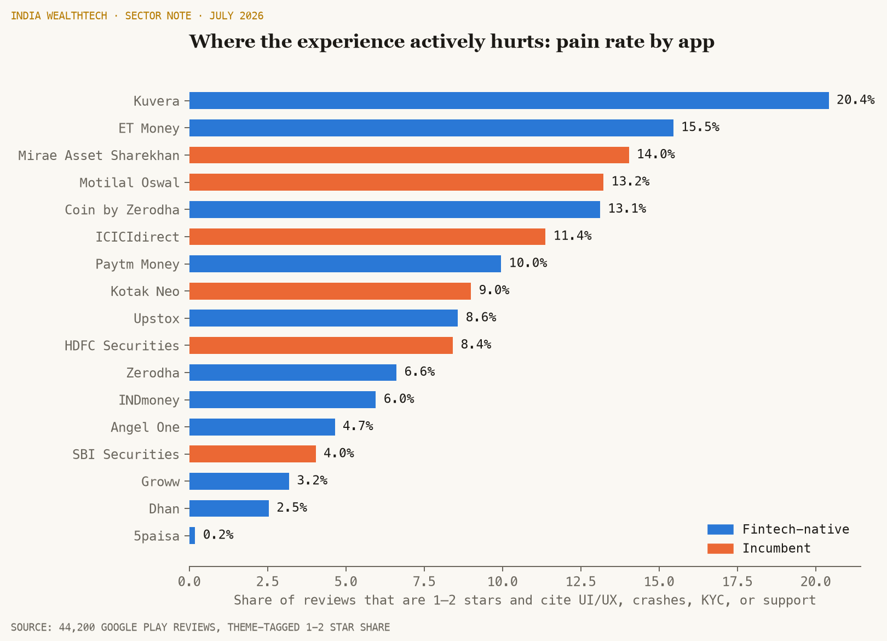

# The AI & UX Gap in Indian Investing

**What would happen if India's investment firms actually fixed their apps?** This project quantifies the digital experience gap across 17 Indian investing platforms from 44,200 real Google Play reviews, links experience quality to NSE active-client growth, and simulates the client and revenue payoff of closing the gap.

Built with Python end to end: scraping, NLP, statistical modeling, and an interactive Streamlit dashboard.

## Headline findings

1. **Fintech-native apps own the top of the experience table.** Groww (88), Dhan (85), and INDmoney (84) lead the Digital Experience Score; most bank-affiliated incumbents cluster lower, with Motilal Oswal's MO Trader last at 68.



2. **The only brokers that grew clients this year sit at the top of that table.** Between mid-2025 and June 2026 the industry shrank, but Dhan (+9.6%) and Groww (+4.6%), the two best-scoring broker apps, were the clear growth outliers. The cross-sectional fit is directional (R² = 0.08 across 13 brokers), and the scatter makes the asymmetry obvious: no bottom-half app grew.



3. **AI is whitespace, not a battleground.** Only 0.6% of 44,200 reviews mention AI, advisory, or smart features at all. Nobody has yet made AI part of the retail investing conversation in India, which is exactly why an AI-led experience upgrade is an open opportunity rather than a catch-up game.



4. **The pain is specific and fixable.** The complaint mix (1-2 star reviews tagged by theme) shows incumbents losing users to performance issues and support failures more than to missing features.



## How it works

```
Google Play (live)          NSE active clients (public)
      |                              |
  src/scrape.py                data/nse_active_clients.csv
      |                              |
  src/nlp.py         VADER sentiment + theme lexicons
      |                              |
  src/scores.py      Digital Experience Score per firm
      \______________________________/
                     |
                src/model.py     growth regression + bootstrap CI
                     |
        src/charts.py + app/streamlit_app.py
```

**Digital Experience Score (0-100)** = 50% live Play Store rating + 30% mean review sentiment (VADER) + 20% pain-free rate, where the pain rate is the share of reviews that are both 1-2 stars and cite UI/UX, performance, onboarding/KYC, or support. Weights are simple and stated so the score is auditable; every component is in `data/processed/firm_scores.csv`.

**The what-if simulator** applies the fitted elasticity (growth percentage points per experience point, adjustable given the wide confidence band) to a chosen broker's gap against the 75th-percentile score, projecting one-year client adds and revenue at an assumed revenue per active client.

## Run it

```bash
python -m venv .venv && source .venv/bin/activate
pip install -r requirements.txt

python run_pipeline.py        # full pipeline: scrape -> nlp -> scores -> model -> charts
streamlit run app/streamlit_app.py
```

Each stage also runs standalone (`python -m src.scrape`, `src.nlp`, `src.scores`, `src.model`, `src.charts`), and `python run_pipeline.py --count 200` does a quick test pull.

Raw review text is not redistributed in this repo (it is user-generated content scraped from Google Play); the scraper regenerates it in a few minutes. All derived aggregates are committed so the analysis and dashboard work out of the box.

## Data sources

- **Google Play**: app metadata and reviews via `google-play-scraper` (17 apps, India storefront, English reviews, newest first).
- **NSE active clients by broker**: Chittorgarh monthly top-20 broker rankings (2025 and 2026 snapshots), cross-checked against StartupTalky's June 2026 broking market analysis. Sources are cited row-by-row in `data/nse_active_clients.csv`.

## Honest limitations

- n = 13 brokers in the growth regression; the slope is positive but not significant (p = 0.34). This is presented as directional evidence with a bootstrap CI, not causation. The simulator treats the elasticity as an explicit, adjustable assumption.
- English-language reviews only; Play Store only (no iOS).
- Review scraping reflects recent reviewers, who skew toward people with something to say.
- The experience score weights are judgment calls, deliberately simple and disclosed.

## Author

Aditya Dalal, University of Massachusetts Amherst (Managerial Economics & Informatics). CFA Level 1 candidate. Interested in asset management, housing finance, and the economics of digital distribution in Indian financial services.
